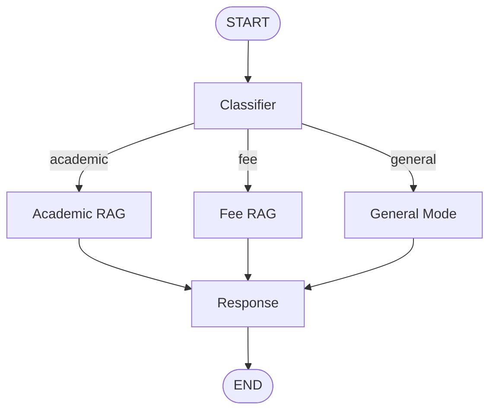

# 🔀 Conditional Workflow: RAG College Assistant

An **agentic AI workflow built with LangGraph** that answers student questions by first **classifying** the question, then **routing** it to the right knowledge source: a Student Handbook, a Fee Structure document, or the model's own general knowledge.

This is a **Retrieval-Augmented Generation (RAG)** system with conditional routing — the graph takes a different path depending on what the student actually asked.

---

## ✨ Features

- 🧭 **Smart classification**: every question is sorted into `academic`, `fee`, or `general`
- 🔀 **Conditional routing**: only the relevant document is searched, saving time and tokens
- 📘 **Academic RAG**: answers from the Student Handbook (attendance, exams, grading, promotion, degree requirements)
- 💳 **Fee RAG**: answers from the Fee Structure document (payments, refunds, late charges, scholarships)
- 💬 **General mode**: greetings and casual questions answered directly, with no document search
- 🎓 **Programme-aware answers**: responses are personalized to the student's programme (e.g. BS Computer Science)
- ⚡ **Fast, cached indexing**: PDFs are embedded once and the FAISS index is saved to disk, so future runs start instantly
- 🚀 **Fast inference** using Groq (`openai/gpt-oss-120b`)
- 🖥️ **Two ways to use it**: terminal or a Streamlit web app

---

## 🧠 How It Works



| Node | Role |
|------|------|
| **classifier** | Reads the student's question and labels it `academic`, `fee`, or `general`. |
| **academic_rag** | Searches the Student Handbook and returns the most relevant passages. |
| **fee_rag** | Searches the Fee Structure document and returns the most relevant passages. |
| **general** | Skips retrieval entirely — the model answers from its own knowledge. |
| **response** | Generates the final answer, using retrieved passages when available and the student's programme for context. |

### 🔀 Routing Logic

```python
def route_query(state: State):
    if state['query_type'] == 'academics':
        return "academic_rag"
    elif state['query_type'] == "fee":
        return "fee_rag"
    else:
        return "general"
```

### 📚 Retrieval-Augmented Generation (RAG) Pipeline

Each source PDF goes through the same pipeline once:

1. **Load** the PDF page by page (PyMuPDF if installed, otherwise PyPDF).
2. **Split** the text into overlapping chunks (`chunk_size=800`, `chunk_overlap=100`).
3. **Embed** each chunk using `sentence-transformers/all-MiniLM-L6-v2`.
4. **Index** the embeddings with FAISS for fast similarity search.
5. **Cache** the finished index to disk (`faiss_cache/`), so it does not need to be rebuilt on the next run — unless the PDF file itself changes.

At query time, the relevant retriever pulls the top 4 matching chunks (`k=4`) and passes them to the response node as context.

---

## 🛠️ Tech Stack

| Technology | Purpose |
|-----------|---------|
| [LangGraph](https://github.com/langchain-ai/langgraph) | Conditional workflow orchestration |
| [LangChain](https://github.com/langchain-ai/langchain) | LLM, document loader and vector store abstractions |
| [Groq](https://groq.com/) (`langchain-groq`) | LLM inference for classification and answers |
| [Sentence Transformers](https://www.sbert.net/) (`all-MiniLM-L6-v2`) | Text embeddings |
| [FAISS](https://github.com/facebookresearch/faiss) | Vector similarity search |
| [PyMuPDF](https://pymupdf.readthedocs.io/) / PyPDF | PDF loading |
| [Streamlit](https://streamlit.io/) | Web user interface |
| [python-dotenv](https://pypi.org/project/python-dotenv/) | Loading API keys from `.env` |

---

## 📁 Project Structure

```
conditionalworkflow/
├── conditional_rag.py        # CLI version
├── conditional_ui.py         # Streamlit web UI
├── studenthandbook1.pdf      # Source document 1 (academic)
├── feestructure.pdf          # Source document 2 (fee)
├── faiss_cache/              # Auto-generated vector index cache (NOT committed to Git)
├── .streamlit/
│   └── config.toml           # Disables the file watcher for fast startup
├── requirements.txt          # Python dependencies
├── .env                      # API key (NOT committed to Git)
├── .gitignore
├── sc/                       # Screenshots used in this README
└── README.md
```

---

## 🚀 Getting Started

### 1. Clone the repository

```bash
git clone https://github.com/<your-username>/<your-repo>.git
cd <your-repo>/conditionalworkflow
```

### 2. Create and activate a virtual environment

**Windows (PowerShell)**
```powershell
python -m venv venv
.\venv\Scripts\Activate.ps1
```

**macOS / Linux**
```bash
python3 -m venv venv
source venv/bin/activate
```

### 3. Install dependencies

```bash
pip install -r requirements.txt
```

`requirements.txt`:
```txt
langgraph
langchain-core
langchain-groq
langchain-community
langchain-text-splitters
langchain-huggingface
sentence-transformers
faiss-cpu
pymupdf
streamlit
python-dotenv
```

### 4. Add your API key

Create a file named `.env` inside `conditionalworkflow/`:

```env
GROQ_API_KEY=your_groq_api_key_here
```

Get your key here: https://console.groq.com/keys

> ⚠️ **Never push your `.env` file to GitHub.** Add it to `.gitignore` (see below).

### 5. Add your source documents

Place these two files in the same folder as the scripts:
- `studenthandbook1.pdf`
- `feestructure.pdf`

> ⚠️ Both PDFs must contain real, selectable text. A scanned/image-only PDF will raise a `No extractable text found` error — OCR it first (for example with `ocrmypdf`) if that happens.

---

## ▶️ Usage

### Option A: Terminal (CLI)

```bash
python conditional_rag.py
```

1. Choose your programme (1–8).
2. Type a question — for example `What is the attendance policy?`
3. Type `exit` or `quit` to end the session.

The first run builds and saves the FAISS index for each PDF, which can take a few minutes for a large handbook. Every run after that loads the saved index instantly.

### Option B: Streamlit Web UI

```bash
streamlit run conditional_ui.py
```

The web app opens in your browser at `http://localhost:8501`.

**UI highlights**
- Programme selector in the sidebar, with session stats (questions asked, answers pulled from documents)
- Chat interface with a route badge on every answer (📘 Academic, 💳 Fee, 💬 General)
- An expander showing the exact source passages used for document-based answers
- Quick-suggestion buttons to get started
- Fully cached models and indexes (`@st.cache_resource`), so the app stays fast after the first load
- Responsive layout for mobile and desktop

---

## ⚙️ Configuration

| Setting | Where | Default |
|---------|-------|---------|
| Chunk size / overlap | `RecursiveCharacterTextSplitter(chunk_size=800, chunk_overlap=100)` | `800` / `100` |
| Chunks retrieved per query | `search_kwargs={"k": 4}` | `4` |
| Embedding model | `HuggingFaceEmbeddings(model_name=...)` | `sentence-transformers/all-MiniLM-L6-v2` |
| Classifier / answer model | `ChatGroq(model=...)` | `openai/gpt-oss-120b` |
| Temperature | `ChatGroq(..., temperature=0.4)` | `0.4` |
| Embedding batch size | `BATCH` in `build_retriver` | `64` |
| Vector index cache location | `CACHE_DIR` | `faiss_cache/` |

---

## 🧯 Troubleshooting

| Problem | Fix |
|---------|-----|
| `PDF not found: ...` | Check the exact file name — the error message now lists every `.pdf` file it actually found in the folder. |
| `No extractable text found in '...'` | The PDF has no real text layer (likely scanned or exported as curves). OCR it first, or re-export it as a proper text PDF. |
| Script seems stuck for a long time on first run | Normal for large PDFs — embeddings are computed on CPU. Watch the printed progress (`...embedded X/Y chunks`). Every run after the first is instant thanks to the FAISS cache. |
| Streamlit takes minutes just to open | Disable the file watcher — see `.streamlit/config.toml` in this project, or run with `streamlit run conditional_ui.py --server.fileWatcherType none`. |
| `ModuleNotFoundError: No module named 'torchvision'` in the terminal | Harmless warning from an unrelated `transformers` submodule scan. It does not affect this app; disabling the file watcher (above) stops it from appearing. |
| `GROQ_API_KEY` not found | Make sure `.env` is in the folder you run the script from, and the key name matches exactly. |
| Images not showing on GitHub | Keep screenshots in the `sc/` folder and commit them together with the README. Use `%20` for spaces in file names (or rename files without spaces). |

---

## 🔒 Recommended `.gitignore`

```gitignore
# Environment and secrets
.env

# Python
venv/
__pycache__/
*.pyc

# Vector index cache (rebuilt automatically)
faiss_cache/
```

---

## 📸 Demo

### 🖥️ Terminal (CLI)


### 🌐 Streamlit UI


---

## 🗺️ Roadmap

- [ ] Support more source documents (course catalog, hostel rules, scholarship policy)
- [ ] Show a confidence score for the classifier
- [ ] Allow uploading a new PDF directly from the UI
- [ ] Multi-turn conversation memory across questions

---

## 🤝 Contributing

Pull requests are welcome. For major changes, please open an issue first to discuss what you would like to change.

---

## 📄 License

This project is licensed under the [MIT License](LICENSE).

---

## 👤 Author

**Syed Haider Ali Shah**
GitHub: [@Syed-Haider-Ali-072](https://github.com/Syed-Haider-Ali-072)

⭐ If you found this project useful, consider giving it a star!