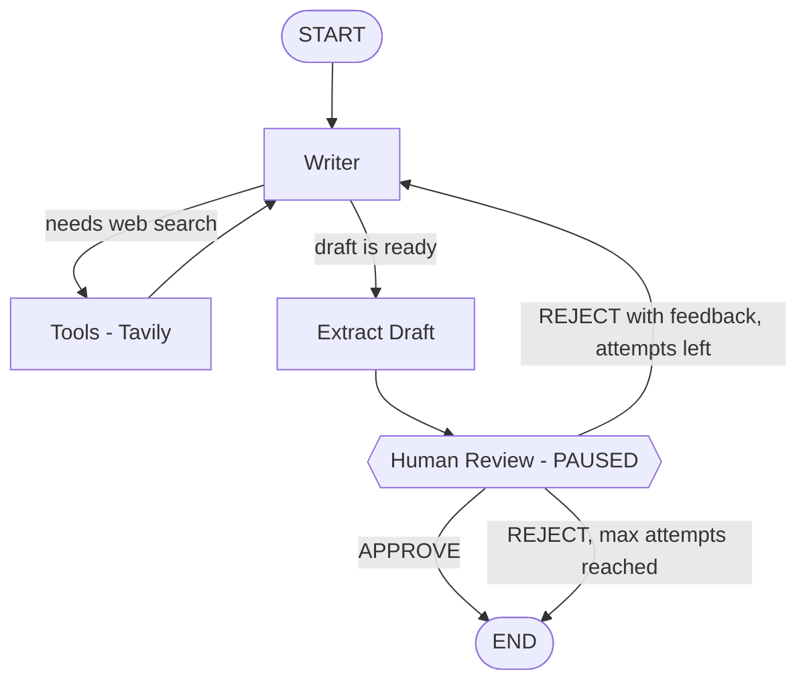

# 🧑‍⚖️ Human-in-the-Loop Workflow: AI LinkedIn Post Generator

An **agentic AI workflow built with LangGraph** where an AI writes a LinkedIn post and **you stay in control**. The workflow pauses after every draft and waits for your decision. Approve it, or reject it with feedback and the AI rewrites it based on what you said.

It ships with two interfaces: a **terminal (CLI)** version and a polished **Streamlit web UI**.

---

## ✨ Features

- 🛑 **True human-in-the-loop**: the graph pauses with `interrupt()` and resumes only when you decide
- 💬 **Feedback-driven rewrites**: your rejection notes go straight to the writer
- 🌐 **Live web search** with Tavily for fresh stats and trends
- 🛠️ **Tool calling**: the writer decides when it needs to search
- 💾 **State persistence** with a LangGraph checkpointer (`MemorySaver`) so the paused workflow can be resumed
- 🔁 **Retry limit**: stops after 3 attempts
- ⚡ **Fast inference** using Groq (`openai/gpt-oss-120b`)
- 🖥️ **Two ways to use it**: terminal or Streamlit web app

---

## 🧠 How It Works



| Node | Role |
|------|------|
| **writer** | Writes the LinkedIn post. Can call Tavily search first. On a retry, it receives your feedback and fixes every point. |
| **tools** | Runs the Tavily search when the writer requests it, then returns the results to the writer. |
| **extract_draft** | Takes the writer's final message and saves it as the draft. |
| **human_review** | Pauses the graph using `interrupt()`, shows you the draft, and waits for your decision. |

### 🔀 Routing Logic

- **`should_use_tool`**: if the writer's last message contains tool calls, go to `tools`; otherwise go to `extract_draft`.
- **`should_stop_looping`**: end if the post is approved or if `attempt >= 3`; otherwise go back to `writer`.

### ⏸️ How the Pause and Resume Works

1. `app.invoke(initial_state, config)` runs until `human_review_node` calls `interrupt(...)`.
2. The result contains an `__interrupt__` key with the review request.
3. You type a decision, and the workflow continues with `app.invoke(Command(resume=decision), config)`.
4. The checkpointer restores the saved state using the same `thread_id`, so nothing is lost while waiting.

### ✍️ Decision Format

| You type | What happens |
|----------|--------------|
| `APPROVE` | The post is accepted and the workflow ends. |
| `REJECT: <your feedback>` | The feedback is sent to the writer, which creates a new draft. |

Example:
```
REJECT: Make the hook stronger and shorten paragraph 2.
```

### ✅ Review Criteria

1. Strong hook in the first line
2. One clear and valuable takeaway
3. Easy to skim, with short paragraphs
4. Around 150–200 words
5. Ends with a question or call to action
6. Professional and engaging tone
7. No hashtags

---

## 🛠️ Tech Stack

| Technology | Purpose |
|-----------|---------|
| [LangGraph](https://github.com/langchain-ai/langgraph) | Workflow orchestration, `interrupt`, `Command`, checkpointing |
| [LangChain](https://github.com/langchain-ai/langchain) | LLM and tool abstractions |
| [Groq](https://groq.com/) (`langchain-groq`) | LLM inference for the writer |
| [Tavily](https://tavily.com/) (`langchain-tavily`) | Web search tool |
| [Streamlit](https://streamlit.io/) | Web user interface |
| [python-dotenv](https://pypi.org/project/python-dotenv/) | Loading API keys from `.env` |

---

## 📁 Project Structure

```
.
├── humaninthe_loop.py        # CLI version (rename to match your file)
├── linkedin_ui.py            # Streamlit web UI
├── requirements.txt          # Python dependencies
├── .env                      # API keys (NOT committed to Git)
├── .gitignore
├── sc/                       # Screenshots used in this README
└── README.md
```

---

## 🚀 Getting Started

### 1. Clone the repository

```bash
git clone https://github.com/<your-username>/<your-repo>.git
cd <your-repo>
```

### 2. Create and activate a virtual environment

**Windows (PowerShell)**
```powershell
python -m venv venv
.\venv\Scripts\Activate.ps1
```

**macOS / Linux**
```bash
python3 -m venv venv
source venv/bin/activate
```

### 3. Install dependencies

```bash
pip install -r requirements.txt
```

`requirements.txt`:
```txt
langgraph
langchain-core
langchain-groq
langchain-tavily
streamlit
python-dotenv
```

### 4. Add your API keys

Create a file named `.env` in the project root:

```env
GROQ_API_KEY=your_groq_api_key_here
TAVILY_API_KEY=your_tavily_api_key_here
```

Get your keys here:
- Groq: https://console.groq.com/keys
- Tavily: https://app.tavily.com/

> ⚠️ **Never push your `.env` file to GitHub.** Add it to `.gitignore` (see below).

---

## ▶️ Usage

### Option A: Terminal (CLI)

```bash
python humaninthe_loop.py
```

1. Enter a topic.
2. Read the generated post.
3. Type `APPROVE` or `REJECT: your feedback`.
4. Repeat until the post is approved or 3 attempts are used.

### Option B: Streamlit Web UI

```bash
streamlit run linkedin_ui.py
```

The web app opens in your browser at `http://localhost:8501`.

**UI highlights**
- 3-step tracker: Topic → Review draft → Final post
- Automatic quality chips: word count, paragraph count, hashtag check, question or CTA check
- **Approve** button and **Reject & improve** button with a feedback box
- Attempt counter with a progress bar
- Review history of earlier drafts and your feedback
- Copy-ready final text and a `.txt` download button

---

## 📸 Demo

### 🖥️ Terminal (CLI)


### 🌐 Streamlit UI


---

## ⚙️ Configuration

| Setting | Where | Default |
|---------|-------|---------|
| Max rewrite attempts | `should_stop_looping` (`state["attempt"] >= 3`) | `3` |
| Writer temperature | `ChatGroq(..., temperature=0.7)` | `0.7` |
| Search results per query | `TavilySearch(max_results=3)` | `3` |
| Session ID | `config["configurable"]["thread_id"]` | `linkedin-human-review` (CLI), random per session (UI) |

---

## 🧩 Design Notes

- **Checkpointer is required.** `interrupt()` needs a checkpointer to save state while waiting for you. This project uses `MemorySaver`, which keeps state in memory only, so a paused workflow is lost if the program stops.
- **Streamlit reruns the script on every click.** In the web UI, the graph is built inside a cached function (`@st.cache_resource`) so the `MemorySaver` survives between clicks. Each browser session gets its own `thread_id`, so separate sessions do not mix.

---

## 🧯 Troubleshooting

| Problem | Fix |
|---------|-----|
| `ModuleNotFoundError: No module named 'langchain.tavily'` | Use `from langchain_tavily import TavilySearch` and run `pip install langchain-tavily`. |
| `429 Rate limit exceeded` | You hit the API rate limit. Wait a minute and try again, or check your plan and usage in the provider console. |
| `GROQ_API_KEY` or `TAVILY_API_KEY` not found | Make sure `.env` is in the folder you run the script from, and the key names match exactly. |
| Streamlit review step seems to restart | Make sure the graph is built inside the cached function and the app is not restarted between clicks. |
| Images not showing on GitHub | Keep screenshots in the `sc/` folder and commit them together with the README. Use `%20` for spaces in file names (or rename files without spaces). |

---

## 🔒 Recommended `.gitignore`

```gitignore
# Environment and secrets
.env

# Python
venv/
__pycache__/
*.pyc
```

---

## 🗺️ Roadmap

- [ ] Persistent checkpointer (SQLite or Postgres) so paused workflows survive restarts
- [ ] Edit the draft directly in the UI before approving
- [ ] Save approved posts to a file or database
- [ ] Support for other platforms (X, Instagram)

---

## 🤝 Contributing

Pull requests are welcome. For major changes, please open an issue first to discuss what you would like to change.

---

## 📄 License

This project is licensed under the [MIT License](LICENSE).

---

## 👤 Author

**Syed Haider Ali Shah**
GitHub: [@Syed-Haider-Ali-072](https://github.com/Syed-Haider-Ali-072)


⭐ If you found this project useful, consider giving it a star!