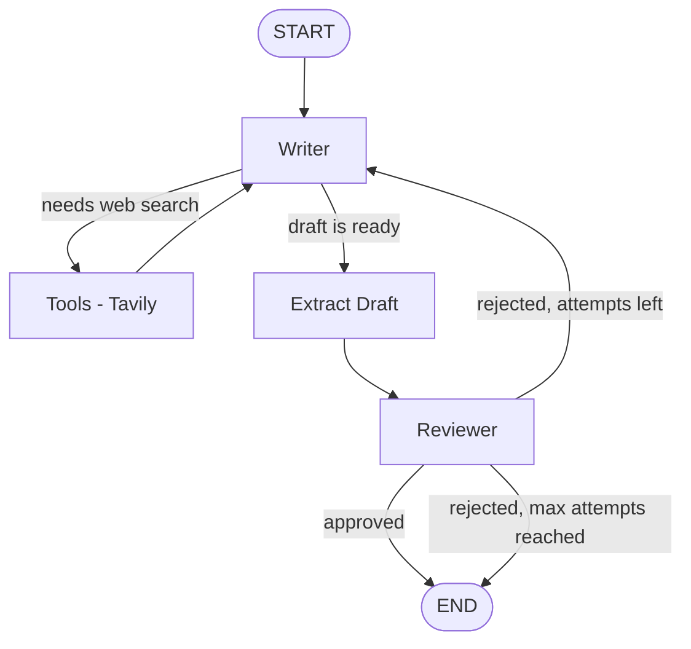

# 🔁 Iterative Workflow: AI LinkedIn Post Generator

An **agentic AI workflow built with LangGraph** that writes a LinkedIn post, reviews it on its own, and keeps improving it until it is publish-ready (or the retry limit is reached).

A **Writer agent** drafts the post (and can search the web for fresh information). A **Reviewer agent** then judges the draft against a strict checklist. If the post is rejected, the reviewer's feedback goes back to the writer and the loop repeats.

---

## ✨ Features

- 🔄 **Iterative self-improvement loop**: write → review → rewrite until approved
- 🌐 **Live web search** with Tavily for current stats and trends
- 🛠️ **Tool calling**: the writer decides when it needs to search
- 🧐 **Automated reviewer** with a 7-point quality checklist
- 🛑 **Safe stopping**: ends on approval or after a maximum of 3 attempts
- ⚡ **Fast inference** using Groq (`openai/gpt-oss-120b`) for both agents
- 🧩 **Clean LangGraph design** with conditional routing and a typed shared state

---

## 🧠 How It Works



| Node | Role |
|------|------|
| **writer** | Writes the LinkedIn post. Can call Tavily search first. On a retry, it receives the reviewer's feedback and fixes every issue. |
| **tools** | Runs the Tavily search when the writer requests it, then returns the results to the writer. |
| **extract_draft** | Takes the writer's final message and stores it as the draft. |
| **reviewer** | Checks the draft against the criteria below and returns `Verdict` and `Feedback`. |

### ✅ Reviewer Criteria

1. Strong hook in the first line
2. One clear and valuable takeaway
3. Easy to skim, with short paragraphs
4. Around 150–200 words
5. Ends with a question or call to action
6. Professional and engaging tone
7. No hashtags

### 🔀 Routing Logic

- **`should_use_tool`**: if the writer's last message contains tool calls, go to `tools`; otherwise go to `extract_draft`.
- **`should_stop_looping`**: end if the post is approved or if `attempt >= 3`; otherwise go back to `writer`.

---

## 🛠️ Tech Stack

| Technology | Purpose |
|-----------|---------|
| [LangGraph](https://github.com/langchain-ai/langgraph) | Workflow / graph orchestration |
| [LangChain](https://github.com/langchain-ai/langchain) | LLM and tool abstractions |
| [Groq](https://groq.com/) (`langchain-groq`) | LLM inference for writer and reviewer |
| [Tavily](https://tavily.com/) (`langchain-tavily`) | Web search tool |
| [python-dotenv](https://pypi.org/project/python-dotenv/) | Loading API keys from `.env` |

---

## 📁 Project Structure

```
.
├── iterative_workflow.py     # Main script (rename to match your file)
├── requirements.txt          # Python dependencies
├── .env                      # API keys (NOT committed to Git)
├── .gitignore
├── sc/                       # Screenshots used in this README
└── README.md
```

---

## 🚀 Getting Started

### 1. Clone the repository

```bash
git clone https://github.com/<your-username>/<your-repo>.git
cd <your-repo>
```

### 2. Create and activate a virtual environment

**Windows (PowerShell)**
```powershell
python -m venv venv
.\venv\Scripts\Activate.ps1
```

**macOS / Linux**
```bash
python3 -m venv venv
source venv/bin/activate
```

### 3. Install dependencies

```bash
pip install -r requirements.txt
```

`requirements.txt`:
```txt
langgraph
langchain-core
langchain-groq
langchain-tavily
python-dotenv
```

### 4. Add your API keys

Create a file named `.env` in the project root:

```env
GROQ_API_KEY=your_groq_api_key_here
TAVILY_API_KEY=your_tavily_api_key_here
```

Get your keys here:
- Groq: https://console.groq.com/keys
- Tavily: https://app.tavily.com/

> ⚠️ **Never push your `.env` file to GitHub.** Add it to `.gitignore` (see below).

### 5. Run the workflow

```bash
python iterative_workflow.py
```

You will be asked for a topic:

```
What do you want a LinkedIn post about?
```

The workflow then writes, reviews and improves the post automatically, and prints the final version, the total number of attempts, and whether it was approved.

---

## 📸 Demo

> Screenshots of the workflow running in the terminal.


---

## ⚙️ Configuration

| Setting | Where | Default |
|---------|-------|---------|
| Max rewrite attempts | `should_stop_looping` (`state['attempt'] >= 3`) | `3` |
| Graph recursion limit | `app.invoke(..., config={"recursion_limit": 25})` | `25` |
| Writer temperature | `ChatGroq(..., temperature=0.7)` | `0.7` (more creative) |
| Reviewer temperature | `ChatGroq(..., temperature=0.2)` | `0.2` (more consistent) |
| Search results per query | `TavilySearch(max_results=3)` | `3` |

---

## 🧯 Troubleshooting

| Problem | Fix |
|---------|-----|
| `ModuleNotFoundError: No module named 'langchain.tavily'` | Use the correct import: `from langchain_tavily import TavilySearch` and run `pip install langchain-tavily`. |
| `429 Rate limit exceeded` | You hit the API rate limit. Wait a minute and run again, or check your plan and usage in the provider console. |
| `GROQ_API_KEY` or `TAVILY_API_KEY` not found | Make sure the `.env` file is in the same folder you run the script from, and the key names match exactly. |
| Images not showing on GitHub | Keep screenshots inside the `sc/` folder and commit them with the README. Use `%20` for spaces in file names (or rename files without spaces). |

---

## 🔒 Recommended `.gitignore`

```gitignore
# Environment and secrets
.env

# Python
venv/
__pycache__/
*.pyc
```

---

## 🗺️ Roadmap

- [ ] Streamlit web interface
- [ ] Human-in-the-loop approval before publishing
- [ ] Save approved posts to a file
- [ ] Support for multiple platforms (X, Instagram)

---

## 🤝 Contributing

Pull requests are welcome. For major changes, please open an issue first to discuss what you would like to change.

---

## 📄 License

This project is licensed under the [MIT License](LICENSE).

---

## 👤 Author

**Syed Haider Ali Shah**
GitHub: [@Syed-Haider-Ali-072](https://github.com/Syed-Haider-Ali-072)


⭐ If you found this project useful, consider giving it a star!