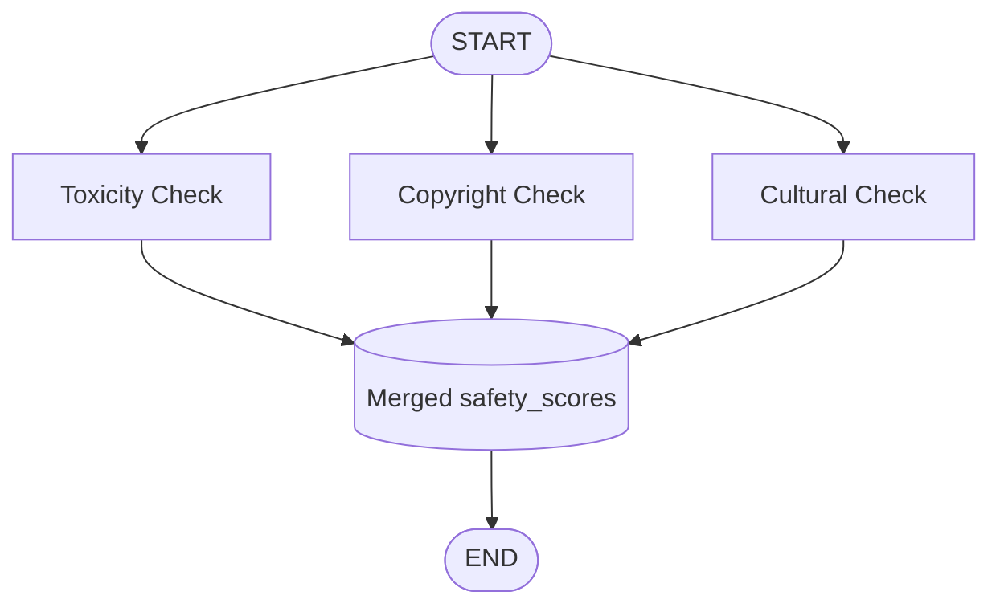

# ⚡ Parallel Workflow: AI Content Safety Analyzer

An **agentic AI workflow built with LangGraph** that checks a piece of text (for example a video script) for three kinds of risk **at the same time**, then merges the results into one safety report.

Instead of running the checks one after another, the graph **fans out** into three parallel branches and **fans in** to a single shared state. That makes the analysis faster and the design easy to extend.

---

## ✨ Features

- ⚡ **Parallel execution**: three independent AI checks run at the same time
- 🧩 **Fan-out / fan-in design** using LangGraph edges
- 🔗 **Custom state reducer** (`merge_score_dicts`) that safely merges results from parallel branches
- 📊 **Simple scoring**: every check returns a score from `0` (clean) to `100` (high risk)
- ⚡ **Fast inference** using Groq (`openai/gpt-oss-120b`)
- 🖥️ **Two ways to use it**: terminal or Streamlit web app

### The Three Checks

| Branch | Node | Score key | What it looks for |
|--------|------|-----------|-------------------|
| 1 | `toxicity_node` | `toxicity_level` | Profanity, aggression, hate speech, toxicity |
| 2 | `copyright_check` | `copyright_risk` | Plagiarism, unoriginal content, trademark risk |
| 3 | `cultural_node` | `cultural_insensitivity` | Regional sensitivities, political landmines, cultural insensitivity |

---

## 🧠 How It Works



1. The graph starts with `raw_text` and an empty `safety_scores` dictionary.
2. Three edges leave `START`, so all three nodes run **in parallel**.
3. Each node asks the LLM for a single integer score and returns a small dictionary, for example `{"toxicity_level": 85}`.
4. The reducer `merge_score_dicts` combines those small dictionaries into one.
5. When all branches finish, the graph ends and returns the full report.

### 🔗 Why a Reducer Is Needed

Three nodes write to the **same** state key (`safety_scores`) in the same step. Without a reducer, LangGraph would not know how to combine them and would raise an error. The reducer solves this:

```python
def merge_score_dicts(existing: dict, newupdate: dict) -> dict:
    if existing is None:
        return newupdate
    return {**existing, **newupdate}
```

It is attached to the state field with `Annotated`:

```python
class AnalyzerState(TypedDict):
    raw_text: str
    safety_scores: Annotated[dict[str, int], merge_score_dicts]
```

### 📤 Output Format

The final result is one merged dictionary:

```python
{
    "toxicity_level": <0-100>,
    "copyright_risk": <0-100>,
    "cultural_insensitivity": <0-100>
}
```

---

## 🛠️ Tech Stack

| Technology | Purpose |
|-----------|---------|
| [LangGraph](https://github.com/langchain-ai/langgraph) | Parallel workflow orchestration and state reducers |
| [LangChain](https://github.com/langchain-ai/langchain) | LLM abstractions |
| [Groq](https://groq.com/) (`langchain-groq`) | LLM inference for all three checks |
| [Streamlit](https://streamlit.io/) | Web user interface |
| [python-dotenv](https://pypi.org/project/python-dotenv/) | Loading API keys from `.env` |

---

## 📁 Project Structure

```
.
├── parallel_workflow.py      # CLI version (rename to match your file)
├── safety_analyzer_ui.py     # Streamlit web UI
├── requirements.txt          # Python dependencies
├── .env                      # API key (NOT committed to Git)
├── .gitignore
├── sc/                       # Screenshots used in this README
└── README.md
```

---

## 🚀 Getting Started

### 1. Clone the repository

```bash
git clone https://github.com/<your-username>/<your-repo>.git
cd <your-repo>
```

### 2. Create and activate a virtual environment

**Windows (PowerShell)**
```powershell
python -m venv venv
.\venv\Scripts\Activate.ps1
```

**macOS / Linux**
```bash
python3 -m venv venv
source venv/bin/activate
```

### 3. Install dependencies

```bash
pip install -r requirements.txt
```

`requirements.txt`:
```txt
langgraph
langchain-core
langchain-groq
streamlit
python-dotenv
```

### 4. Add your API key

Create a file named `.env` in the project root:

```env
GROQ_API_KEY=your_groq_api_key_here
```

Get your key here: https://console.groq.com/keys

> ⚠️ **Never push your `.env` file to GitHub.** Add it to `.gitignore` (see below).

---

## ▶️ Usage

### Option A: Terminal (CLI)

```bash
python parallel_workflow.py
```

The script analyzes the built-in `sample_script` and prints the merged scores. To test your own text, replace the value of `sample_script` in the file.

### Option B: Streamlit Web UI

```bash
streamlit run safety_analyzer_ui.py
```

The web app opens in your browser at `http://localhost:8501`.

**UI highlights**
- Paste any text and click **Analyze**
- Three score cards, each with a large score out of 100 and a colored bar
- Each card updates as soon as its branch finishes, so you can watch the parallel execution
- Final verdict banner: *Looks safe to publish*, *Publish with caution*, or *Not safe to publish*
- Sample text button, Clear button, and a downloadable `.txt` report

**Risk levels used in the UI**

| Score | Level |
|-------|-------|
| 0 – 33 | 🟢 Low risk |
| 34 – 66 | 🟡 Medium risk |
| 67 – 100 | 🔴 High risk |

---

## 📸 Demo

### 💻 Code


### 🖥️ Terminal (CLI)


### 🌐 Streamlit UI


---

## ⚙️ Configuration

| Setting | Where | Default |
|---------|-------|---------|
| Model | `ChatGroq(model=...)` | `openai/gpt-oss-120b` |
| Temperature | `ChatGroq(..., temperature=0.2)` | `0.2` (low, for consistent scores) |
| Score range | Prompt text in each node | `0` to `100` |
| Input text | `sample_script` (CLI) or text box (UI) | Built-in sample |

---

## 🧩 Extending the Workflow

Adding a fourth check (for example *misinformation risk*) takes three steps:

1. Write a new node that returns `{"safety_scores": {"misinformation_risk": score}}`.
2. Register it with `builder.add_node(...)`.
3. Connect it with `builder.add_edge(START, ...)` and `builder.add_edge(..., END)`.

The reducer handles the merging automatically, and the new branch runs in parallel with the others.

---

## ⚠️ Known Limitations

- **Scores default to `0` on a bad reply.** Each node expects the model to reply with only an integer. If the reply contains anything else (for example `Score: 85`), `int()` fails and the score falls back to `0`. A `0` can therefore mean "no risk" or "the reply was not a clean number".
- **Scores are model judgments.** They are useful for quick screening, not a replacement for human review.

---

## 🧯 Troubleshooting

| Problem | Fix |
|---------|-----|
| `429 Rate limit exceeded` | Three calls run at once, which uses your rate limit faster. Wait a minute and try again, or check your plan in the Groq console. |
| `GROQ_API_KEY` not found | Make sure `.env` is in the folder you run the script from, and the key name matches exactly. |
| A score shows `0` unexpectedly | See *Known Limitations* above. The model probably replied with extra text. |
| Images not showing on GitHub | Keep screenshots in the `sc/` folder and commit them together with the README. Use `%20` for spaces in file names (or rename files without spaces). |

---

## 🔒 Recommended `.gitignore`

```gitignore
# Environment and secrets
.env

# Python
venv/
__pycache__/
*.pyc
```

---

## 🗺️ Roadmap

- [ ] Stricter score parsing so bad replies are retried instead of becoming `0`
- [ ] Explanations: a short reason next to each score
- [ ] More checks (misinformation, age suitability, brand safety)
- [ ] Batch analysis of multiple scripts

---

## 🤝 Contributing

Pull requests are welcome. For major changes, please open an issue first to discuss what you would like to change.

---

## 📄 License

This project is licensed under the [MIT License](LICENSE).

---

## 👤 Author

**Syed Haider Ali Shah**
GitHub: [@Syed-Haider-Ali-072](https://github.com/Syed-Haider-Ali-072)


⭐ If you found this project useful, consider giving it a star!